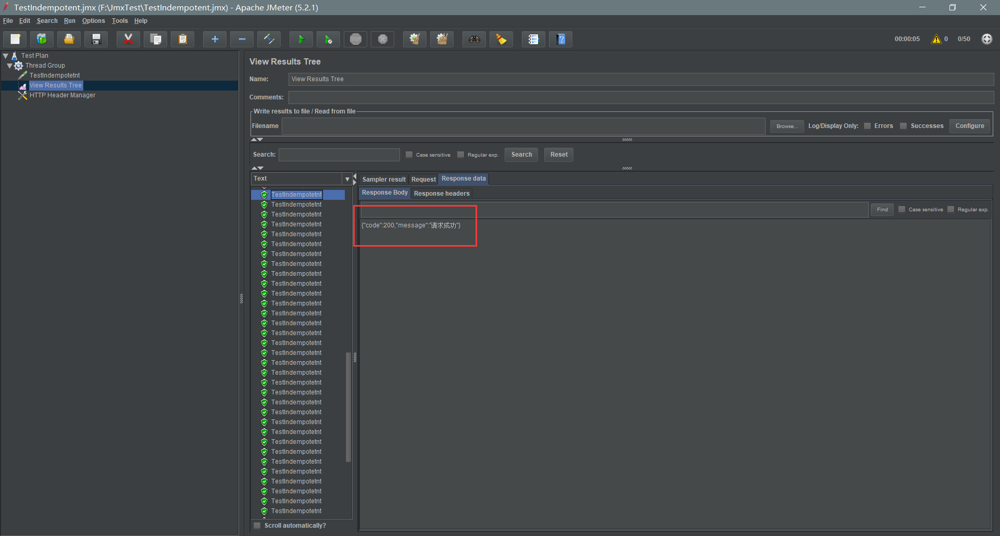

# SpringBoot+Redis实现接口的幂等性

### 相关包作用
##### annotation  
定义了自定义注解AutoIdempotent,标注此注解的方法将会被拦截器拦截实现接口的幂等性
##### controller
提供获取token和测试幂等性的接口
##### exception
提供全局异常捕获功能以及一个自定义异常类
##### interceptor
拦截标注@AutoIdempotent注解的方法,第一次请求会校验token,并且从redis中删除token    
如果在校验过程中,抛出异常,说明是重复请求。
##### redis
封装了redis的存储token,获取token,判断token是否存在,删除token方法
##### token
提供生成token和校验token的方法
##### vo
值对象 封装返回类型
### 使用Jmeter并发测试
并发模拟50个请求,  
第一次请求返回请求成功,之后的请求都会返回重复请求信息  
